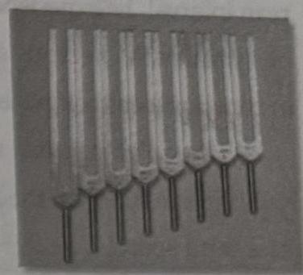

62 The Tuning Fork Experience :: PART 2
PART 2 :: The Tuning Fork Experience 63

# Anechoic Reflections

I named the original set of Pythagorean tuned tuning forks I used in the anechoic chamber the Solar Harmonic Spectrum. I liked the term "solar" because the tuning forks had a bright sound and rang the full spectrum of overtones. The chamber, due to sensory isolation, could be very disorienting. In order to keep my bearings and know exactly what I was doing, I developed a journal. Every time I went in the chamber, I systematically recorded my experiments with each interval. I spent one week working with each interval. For example, I would listen to the interval of a fifth for one week, and then the next week I would listen to an interval of a fourth and so on.

At one point, I recorded each interval and played them back on speakers on each side of my bed. I would play the interval at a very low volume in order not to disturb my sleep. I kept a dream journal and the next morning I would record my dreams after being in the interval all night. I got so into being in the different intervals that I bought a special headphone called a bonefone. The bonefone goes around your neck and conducts sounds through bone conduction into the ears. This was before iPods and MP3s. I used a Sony Walkman with a cassette to play back the interval on auto reverse.

I would live as much as possible both in and out of the anechoic chamber inside each interval. I called it interval emersion. The more I knew how the sound affected my mind and body, the better I would be able to know how to use it with a patient. The same formula holds true today. The more you experience and know about an interval, the better you will be able to use it with yourself and others. The tuning forks are learning tools that teach you the knowledge of your own nervous system and the effects of different tunings. Once you understand this, the tuning forks become just another way to connect you to the universal field. With practice, you can think the sound of the tuning forks, and your nervous system and body will come into resonance.

# Solar Harmonic Spectrum
## The Art of Pythagorean Tuning

Pythagoras was a Greek philosopher and mathematician who lived around 580 B.C. He was a contemporary of both Buddha and Confucius and is said to have traveled to Egypt, Mesopotamia, and India in search of knowledge. Pythagoras believed in a "singing universe" which he poetically termed "the music of the spheres." He taught that musical instruments, especially the lyre, when tuned to Pythagorean intervals were capable of tuning the soul to the singing rhythms of the universe.

The lyre was the main instrument the Pythagoreans used to tune the soul. There are many stories about the Pythagoreans and their use of the lyre. One goes like this.

A demented youth forced his way into the dwelling of a prominent judge who had recently sentenced the boy's father to death for a criminal offense. The frenzied lad, bearing a naked sword, approached the jurist, who was dining with friends, and threatened his life. Among the guests was a Pythagorean. Reaching over quietly, he struck an interval upon a lyre which had been laid aside by a musician who had been entertaining the gathering. At the sound of the interval, the crazed young man stopped in his tracks and could not move (still point). He was led away as though in a trance.¹

Today, tuning forks are like a modern lyre which is always in tune. Instead of plucking strings to sound Pythagorean intervals, the modern practitioner can tap tuning forks and achieve the same effect without traditional music training. Tuning forks can go beyond the traditional Greek lyre with their ability to create individual sonic spaces and precise overtones.

Solar Harmonic Spectrum

¹Manley P. Hall, *The Therapeutic Value of Music*, Los Angeles: Philosophical Research Society, 1955, p. 3.