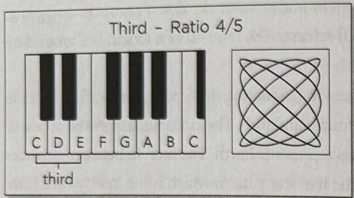
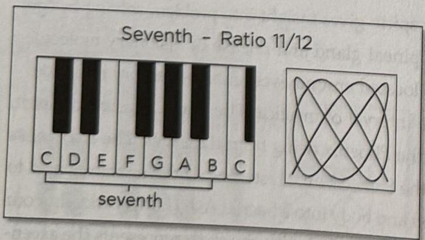
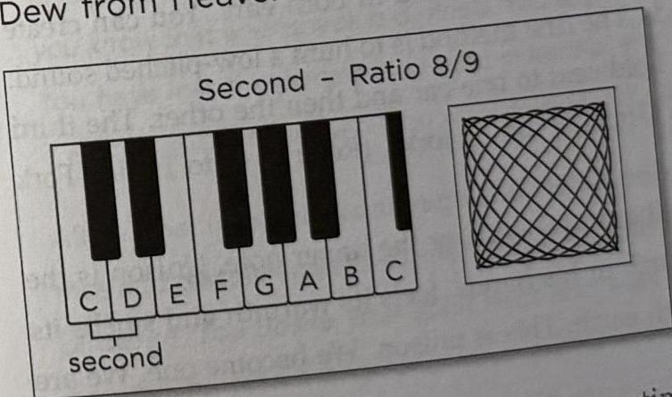

80 The Tuning Fork Experience :: PART 2
PART 2 :: The Tuning Fork Experience 81

# THE INTERVAL OF A THIRD:
Alchemic Furnace, Fire Descending to Earth

ELEMENT: Fire Descending
COLOR: yellow
RATIO: 4/5

BENEFITS: Motivation; focus on goal; getting things done; balances liver and upper GI tract; stimulates digestion, improves sexual drive; balances respiratory diaphragm.

The interval of a third is the Fire of life. The third builds an internal fire that motivates and moves us towards our goals. The interval of a third warms us and resonates with our fire of accomplishment. When we are down and we need to focus on something that we want, the interval of a third will wake us up. The fire illuminates our goal and burns the inner fuel that drives us to take action.

The alchemists called the interval of a third the Alchemic Fire because it heats us and separates the five elements. It is like the fire the alchemists built beneath their alchemic furnaces for their experiments. Listening to the third heats our internal alchemic furnace causing the five elements to activate, separate, and slowly transform into our goals.

# THE INTERVAL OF A SEVENTH:
Sacred Dew, Water Rising to Heaven

ELEMENT: Water Ascending
COLOR: red orange
RATIO: 11/12

BENEFITS: Balances the parietal bones; releases cranial sutures; stimulates cerebrospinal fluid flow; shapes inspirations into dream forms.

The seventh is like warm steam rising. The seventh carries the essence of our vision up into the higher realms. It is the interval of sacred moisture which vibrates with our inspiration. The seventh is the last ascending interval and seeks to complete our journey by merging with the higher tone or octave.

The alchemists said that the interval of a seventh represented the Sacred Moisture that massaged and entered the Philosopher's Stone. The seventh is our higher inspirations in pure form. Edgar Cayce called the seventh the "interval of ideals." Imagine a slide projector shining light through a slide. The slide is our ideal pattern which is projected onto the screen. The screen represents our earthly self and the light represents the higher octave.

In our cranium, the seventh relates to our lateral ventricles, parietal bones, and the movement of cerebrospinal (water) fluid through our cranial sutures and dura. The seventh resonates the frontal, central parietal, temporal, and occiput sutures allowing our parietal bones to lift and open like the petals of a flower to the higher light. When this happens, our inner steam is released from our mortal coil and rises upwards, through the seventh chakra, in spiral motions.

# THE INTERVAL OF A SECOND:
Dew from Heaven Water Falling to Earth

ELEMENT: Water Descending
COLOR: orange
RATIO: 8/9

BENEFITS: Balances genital-urinary system; stimulates lymphatics to discharge; enhances creative thinking and interrupts cyclic thinking processes; balances ovaries; promotes fertilization and enhances attachment of fetus to uterine wall; enhances sexual excitement and relationship bonding.

The second is the interval of creativity and bonding. As Fire dissolves bonds, the second creates bonds. Ideally, the second creates a higher ideal. It is represented by a mother bonding to her child or an artist working to manifest his vision. The