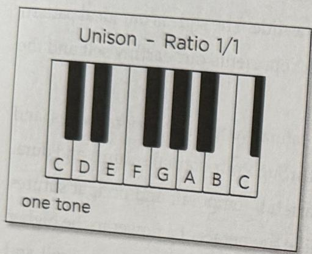

82 The Tuning Fork Experience :: PART 2
PART 2 :: The Tuning Fork Experience 83

Alchemists called the second "dew from heaven" because it was like water embedded in an ideal pattern.

Listening to the second may sound dissonant. This is just a matter of taste. Take some time, relax, and get into the space created by the interval of a second.

UNISON: Mother Earth

ELEMENT: Earth
COLOR: red
RATIO: 1/1

BENEFITS: Settles emotions; stimulates ganglion of impar to promote sympathetic/parasympathetic nervous system balance; centering; disperses scattered thoughts; balances illeosecal valve and lower bowel; relaxes perineal floor; good for cramps, period, muscle, spastic colon, and colitis.

Unison is not an interval. It is one tone played in both ears. You can create unison by using several methods. The first method is to hum a low-pitched sound. The second is to tap C256 and hold next to one ear and then the other. The third way and best way is to use two Otto 128 tuning forks. (Refer to Otto Tuning Fork chapter.)

Unison is the lower note of the octave without the upper note. Unison is the ground. When a farmer holds earth in his hands, feels its warmth and smells its deep aroma, he becomes one with earth. This is unison. We become one. We are united.

Unison as Earth is a low tone or a drone. Listening to long low tones bring us into our body. We feel grounded. Ideally, unison should be a low-pitched ongoing drone sound.

# ELEMENT JOURNEY INTERLUDE

BEFORE THE BEGINNING Imagine that before you exist, there is a potential to be you that is floating in a pulsating, undulating, ocean of universal energy. Your potential is unbounded, free, and can expand effortlessly in all directions and in all dimensions. One day, like a chick hatching from an egg, you become like a butterfly emerging from a cocoon, or like Parsifal leaving the dark forest. You realize it is time to take a cosmic journey. Instantly your potential contracts and you are being conceived as a human being. The journey begins. We are forever evolving and looking to bring ourselves into alignment with the great ocean of Sound or Universal Energy Field.

ETHER As you expand from the first contraction, you enter the space of Ether. Your free spirit begins to etherealize in space as a form. You were potential before, and now you are something. For the first time, you begin to experience the beginnings of boundaries. You have no idea what a boundary is, yet you know that your space is defined. You experience your first emotion—Grief. You have lost the pureness of your potential and your grief is so intense that it is impossible to sustain. You want to go back, and there is no going back.

AIR Ether involuntary contracts and then expands. You are breathing the cosmos and discovering the element of Air. For the first time, you feel the emotion of desire. You desire your spirit back and wish for everything to be as it was before. The search begins for your spirit and you look everywhere and as fast as you can. The desire intensifies and you continue to look and look in every direction.

FIRE You expand and there is relief for a moment. As you contract again, your search is so frantic that your movement rubs the ethereal substance, creating a friction, and you enter the element of Fire. The heat builds and builds with the powerful and consuming frustration of not finding your potential. You