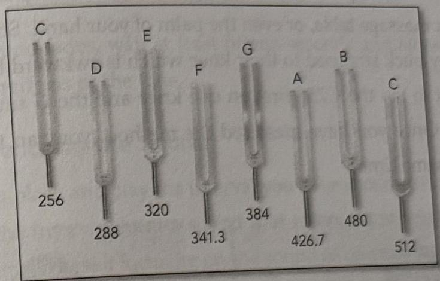

64 The Tuning Fork Experience :: PART 2
PART 2 :: The Tuning Fork Experience 65

A Pythagorean interval can be visualized as the sonic space defined by two tuning forks. Each Pythagorean interval has unique qualities that effect healing and consciousness. When the listener enters the sonic space created by a Pythagorean interval, he experiences a pulse that entrains the whole body and simultaneously tunes the nervous system. Within seconds the listener experiences a shift in consciousness complete with a new mental, emotional, and physical pattern.

When a Pythagorean interval is sounded, it can be visualized as a gateway of sound inside of which the two tones of the tuning forks merge into a spiral to create a third sound. The third sound is called a difference tone in musical language because it is simply the difference in frequency between the two tuning forks. The Pythagoreans, based on their experience, called the difference tone the “Voice of God.” It is the Voice of God that pulses through the whole body, tunes the nervous system, and energizes the five elements.

Creating intervals with tuning forks is easy. Musicians spend a lot of time learning scales and combinations of sounds to create music. Interval tuning is much simpler because it focuses on healing rather than musical performance. All that is required is the ability to lay out the tuning forks in order and count from one through eight. Here is how it works.

## Set Up

Lay out the Solar Harmonic Spectrum in the order below. When making an interval, always use C256 as the number 1 tuning fork and count up to get the second tuning fork. For example, the space between C256 and G is called the interval of a 5th. If you count the numbers or notes from C256 to G, there will be exactly five notes. When you count up, associate the numbers with the letters, i.e., C and F is the interval of a 4th, C and A is the interval of a 6th and so on.

|  C256 | D | E | F | G | A | B | C512  |
| --- | --- | --- | --- | --- | --- | --- | --- |
|  1 | 2 | 3 | 4 | 5 | 6 | 7 | 8  |

Next, select the interval you want to work with. In order to learn how to work with the intervals, begin by selecting the interval of a 5th, C256 and G. In order to sound an interval, you will find there are three components: technique, visualization, and reception. Technique is the method of producing sound. Visualization is what you intend when you produce the sound. Reception is the act of transferring the sound to yourself or someone else for healing.

## Techniques

### KNEE TAP :: Technique 1

1. Hold the tuning forks by the stems with moderate pressure—not too tight and not too loose.
Do not hold your tuning forks by the prongs because the prongs need to vibrate in order to create the sound.

2. Gently tap the flat side of the tuning fork on your kneecap. Do not hit or slap your kneecap with the tuning fork.

