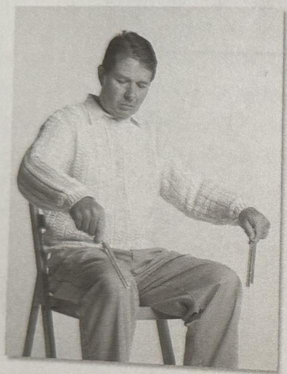
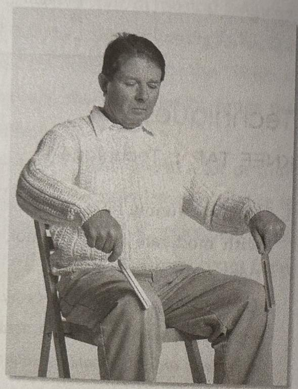
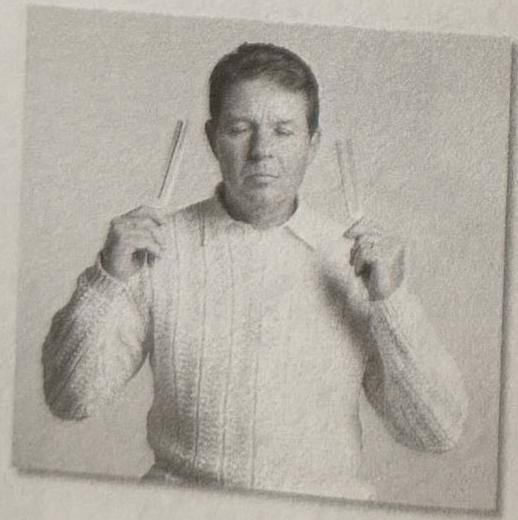
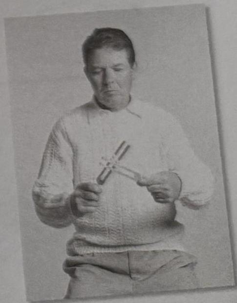

66 The Tuning Fork Experience :: PART 2
PART 2 :: The Tuning Fork Experience 67

All it takes is a gentle yet firm tap and your tuning fork will sound. It is as though you gently drop the flat side of the tuning fork on your kneecap. (If you do not want to tap the forks on your knees, you can tap them on the floor, the side of a massage table, or even the palm of your hand. Some practitioners use a hockey puck strapped to their knee which is awkward but effective.)

It is best to tap the C256 first on one knee and the G tuning fork on the other knee. Once you have mastered the method, you can tap both tuning forks at the same time.

3. Bring the forks slowly to your ears, about three to six inches from your ear canal. Close your eyes and listen.

When the sound stops, lower your tuning forks and switch them from hand to hand. For example, if you listened to the C in your right ear first, than switch it to your left ear for the second tap. Now tap your tuning forks again.

4. When the sound fades, wait at least fifteen seconds and allow yourself to be with the aftereffects of the tone.

## Humming: Anchoring the Sound

Find a safe, quiet place and play the interval you have chosen to work with. While you are inside the interval, hum a sound that resonates within the space of the interval. If you find yourself focusing on the sound of one tuning fork or the other, relax and let your ears find a sound that resonates within the space of both tuning forks. Put down the tuning forks, imagine being in the space of the interval, and hum the sound. Play the interval again and check yourself. Put down the tuning forks and hum the interval sound.

The goal is to develop the ability to hum and shift into the interval anywhere, at will, without having to have the tuning forks.

## OVERTONE TAP :: Technique 2

The second way to sound tuning forks is to tap them together. This method is to be used off the body. It is not to be used directly in the ears.

1. Hold them by the stems and tap them together on their edges, not the flat side of the prongs. You do not have to use a lot of force to get the result. Play with creating an easy sounding tap vs. a banging tap when too much force is used.

2. When you tap them together, the tuning forks will make sounds we call overtones. Move the tuning forks around, slowly and quickly, in the air and listen to the different tones as they get louder and softer. The photos on the following pages demonstrate the movement of the tuning forks over the body. Notice the different positions and their relationship to the body. When you move the tuning forks over the body, it will cause different overtones to ring.

