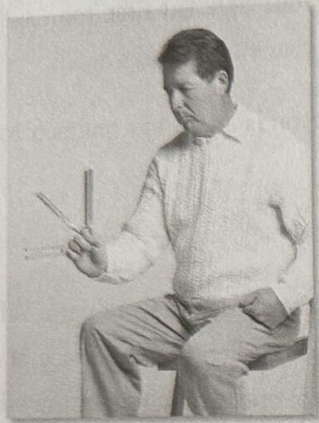
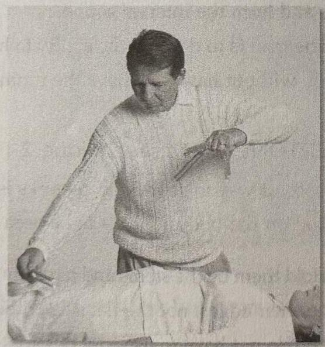
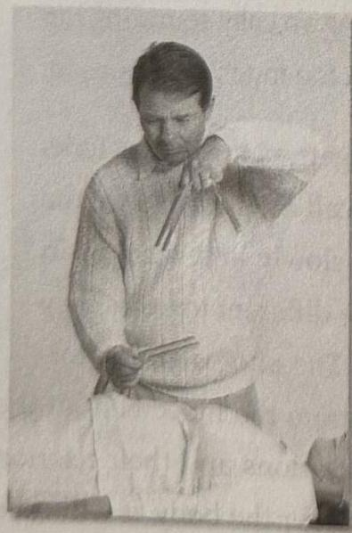
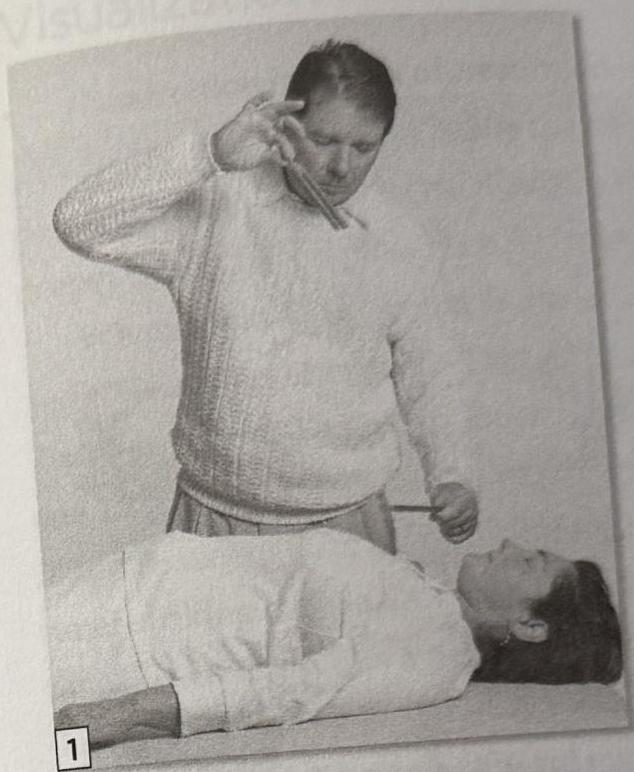
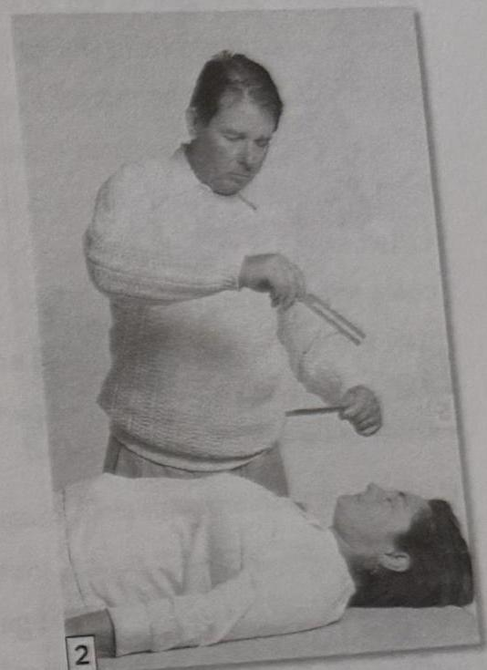
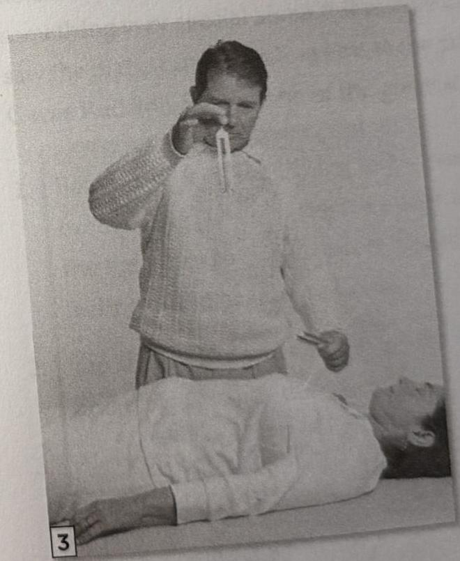
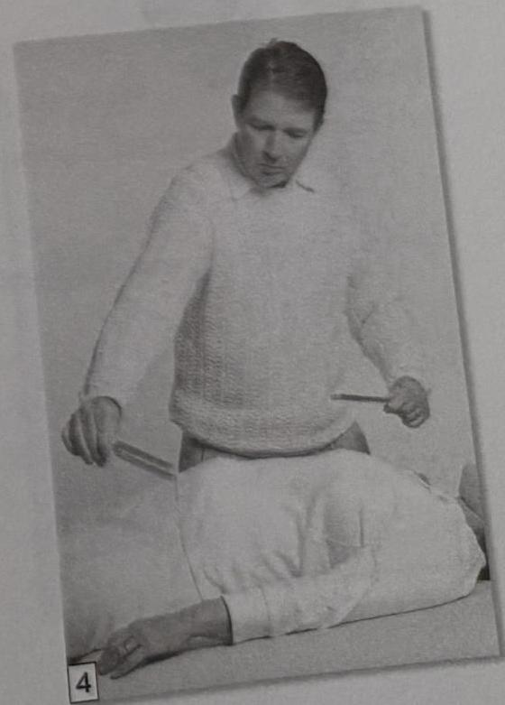

68 The Tuning Fork Experience :: PART 2
PART 2 :: The Tuning Fork Experience 69

3. For practice, take the F, G, and A tuning forks and hold them in your left hand. Place the stems between your fingers. Allow them to stick out in different directions so that they do not touch. Hold the C tuning fork between your thumb and first finger in your right hand. Tap the F, G, and A tuning forks with the C256 tuning fork.

Move the tuning forks around slower and then faster. Then listen to the different overtones. Try holding the F, G, and A tuning forks on top and the C on the bottom. Move them around, and move the C tuning fork in circles underneath the F, G, and A tuning forks. The movement of the C tuning fork will bring out different overtones.

