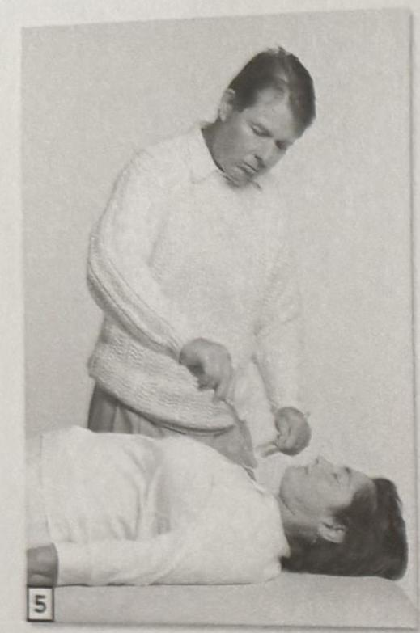
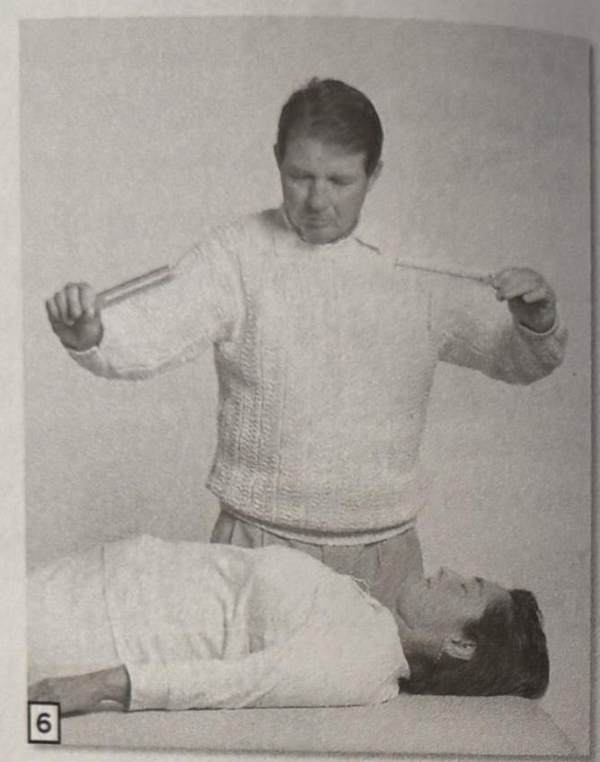
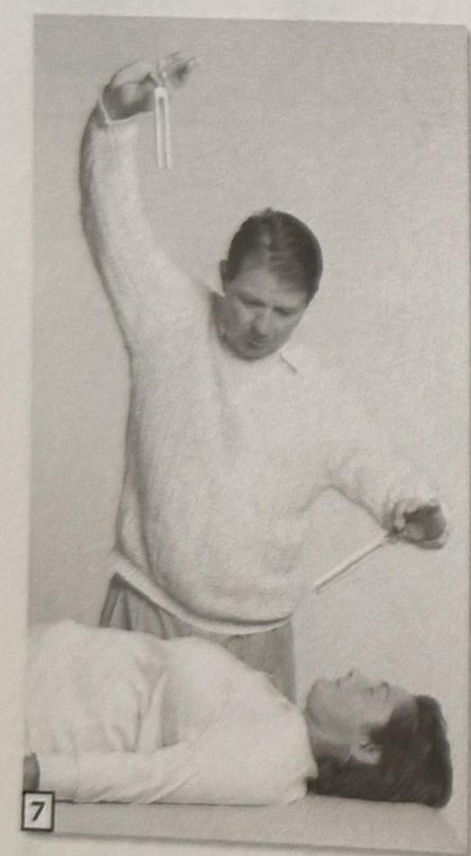
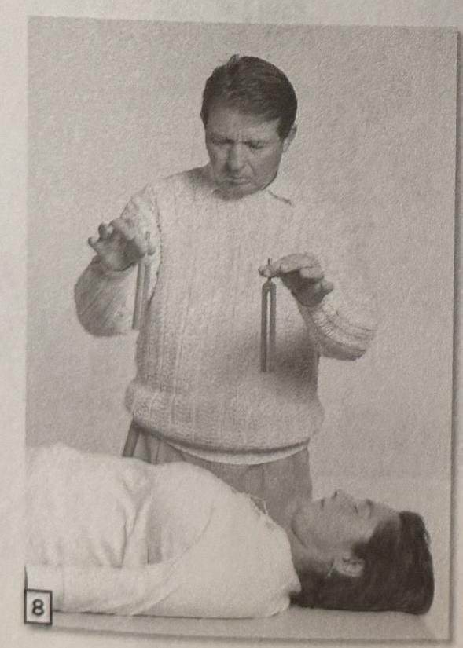

70 The Tuning Fork Experience :: PART 2
PART 2 :: The Tuning Fork Experience 71

## Visualization

Visualization is the act of creating an intention for the sound. The visualization to heal has to be clear before the forks are tapped. Method without visualization is limited. Through visualization, the sound of the tuning forks becomes a deeper healing experience. The following story illustrates this point.

When I was a student at Indiana University, I happened to be in the music auditorium one afternoon. That afternoon a piano concert was to be given by Rudolph Serkin. The piano tuner was tuning, and I was enjoying being the only one in the hall. Since it was dark off stage and I was in the back of the hall, I found it easy to doze off to the tuning sounds. I remember at one point the piano tuner striking middle C over and over. I must have heard him play it thirty or forty times. Then there was a period of silence for two to three minutes. I drifted off in the silence.

Then out of the silence I heard middle C again. This time the note sent shivers up my spine. The sound was completely different, and at the same time I knew the note was the same. Then I heard it again and again. It was like a concert. There was something very special about this middle C. I opened my eyes and to my surprise I saw the piano tuner standing next to the piano. Sitting at the piano playing middle C was Rudolph Serkin, one of the greatest pianists of the 20th century.

1. Before you tap your tuning forks, visualize what you want to accomplish. For example, visualize a positive image and feel the image in your body; ask for the light for the highest good; visualize an element quality; or just picture the feeling of the healing response.
2. Tap the tuning forks and allow the felt feeling of the image to guide your tap and resonate with the sound.
3. Next bring the tuning forks to your ears. Ring them over the body, or place them on the body with the feeling of the visualization as your guide.